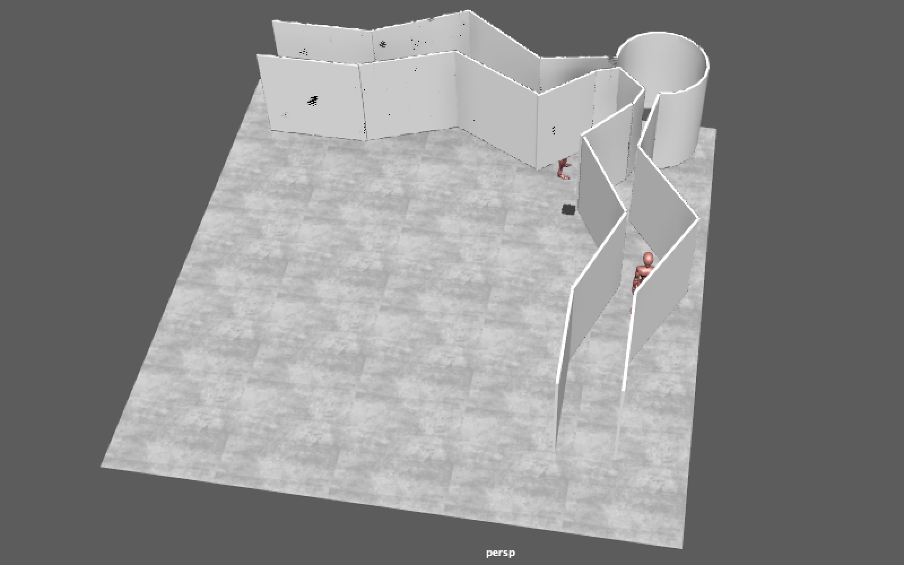
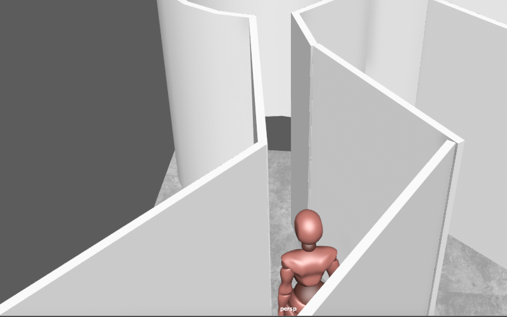
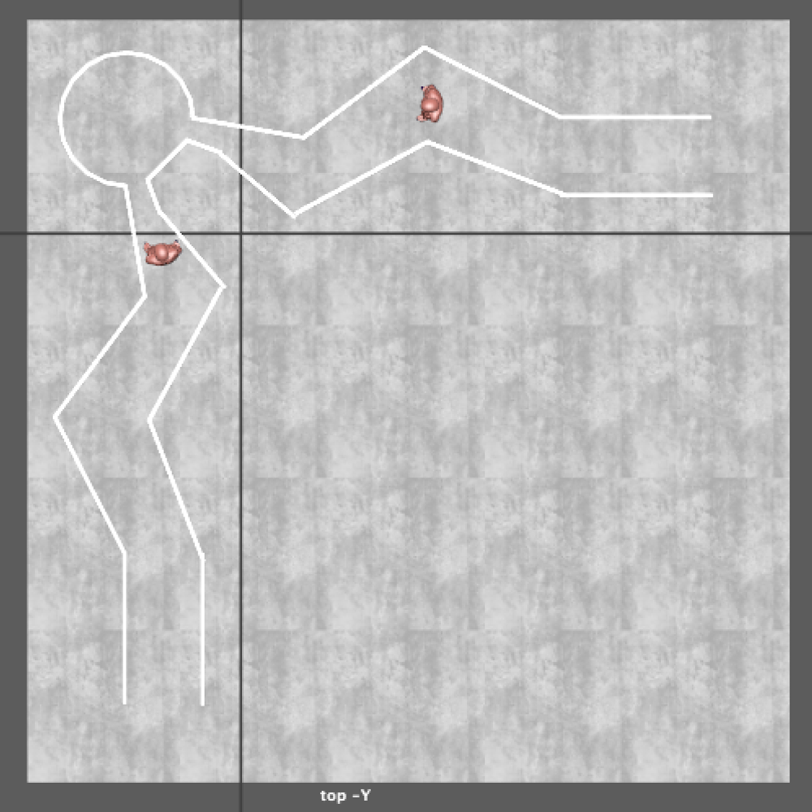
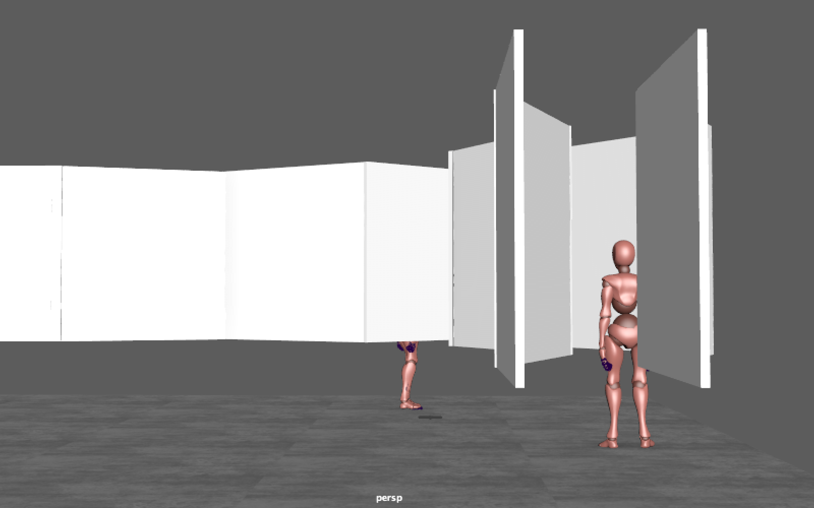

# Recurring Concepts in Art Installation Proposal: "m e e t _ "
February 12, 2018

> “m e e t _ ” is a physical installation piece that provokes the crossing of two gazes of strangers in mid-air in an immersive and infinite space.

## Collaboration and Idea
“m e e t _ ” is a collaboration between [Roland Arnoldt](http://ouiouioui.space) and [Nicolás Escarpentier](http://nicolaspe.com). After a deep cross analysis of our past works, we found common grounds where to associate. Both of us try to create experiences in our works, transcending what the spectators see or do at the moment. While Roland uses the concept of futility to strip away the content of the interaction, Nicolás engages the audience with uncomfortable topics to instigate a reflection. Moreover, both of us only use high technology as a means to get the audience’s attention, more than an essential tool of the piece itself.

We started our exploration with the corner as a defining element of a physical space. It can limit a movement or gaze into a direction (90 degrees) or open it to infinity (270 degrees). In any case, it is also a meeting point if two humans walk into that direction. But what happens if the physical encounter of two bodies is replaced by a virtual encounter in mid-air between two gazes? What if you don't see somebody’s eyes, but you you know you are looking at the same point in the distance? Does the awareness of this crossing of two gazes somewhere in the distance change our perception of infinite space?

We want to play with the notion of non-physical, invisible and at the end "virtual" encounters in a real space. Ideally the mere thought of crossing of gazes of two strangers inspires the imagination of the audience, the invisible meeting point/crossing becomes "real" and helps them to define and feel infinity as a communal experience that ultimately leads to introspection. Finally, we would like to ask the audience an open question: is alone together better than alone?

## Background
We are inspired by two major contemporary works:
1. The curvature of [Richard Serra's Torqued Ellipses'](https://www.diaart.org/collection/artist-a-z/serra-richard) gives the sense of losing yourself inside the installation.
2. The delimitation of space in [Markus Schinwald’s Austrian Pavillion at the 2011 Biannale di Venezia](https://vernissage.tv/2011/08/03/markus-schinwald-austrian-pavilion-biennale-di-venezia-2011/) (even if the panels are hanging one meter above ground).

Taking elements from each of these artists, we want to create two jagged hallways composed of elevated panels, which meet at an inaccessible cylindrical space. As the users enter, they are forced to turn several times, creating immersion in the installation (a principle shared in VR). As they progress, the hallways become narrower, blocking the physical access to the corner itself at the end. This corner is a pivotal moment in which the space suddenly transforms into a cylindrical space, accessible from the two sides only by our eyes, creating the invisible meeting point/crossing of the participant's gazes. Even though they are aware of the other's presence due to the floating panels, they never meet eyes or even see the face of the other person.

Lastly, we encompass all this interaction under [John Dewey's](https://en.wikipedia.org/wiki/Art_as_Experience) concept of what constitutes an experience. By isolating and immersing the spectators, creating a uniqueness in a collective moment, and then traveling the same road to the exterior we create a sense of unity in the encounter with a pervading feeling; therefore, constructing an experience.

In conclusion, the crucial aspects for this experience are:
- The audience should be immersed in the installation
- Each participant is aware of the others presence in a subtle way
- Both gazes cross each other at a certain point in distance
- The gazes should continue into infinity afterwards (the eye of the viewer should not be able to focus on a specific point in distance)

<video width="640" height="480" controls>
  <source src="rca_meet_footage.mp4" type="video/mp4">
</video>
