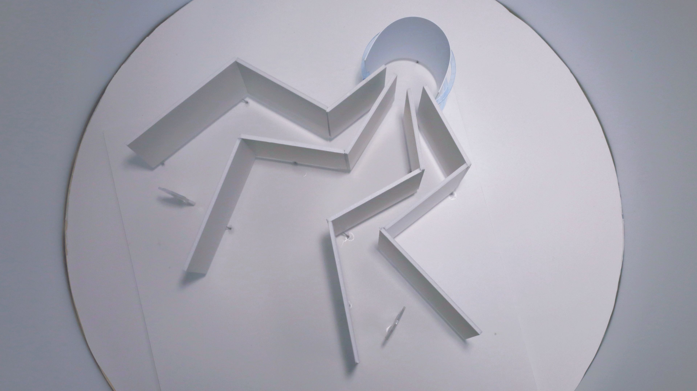
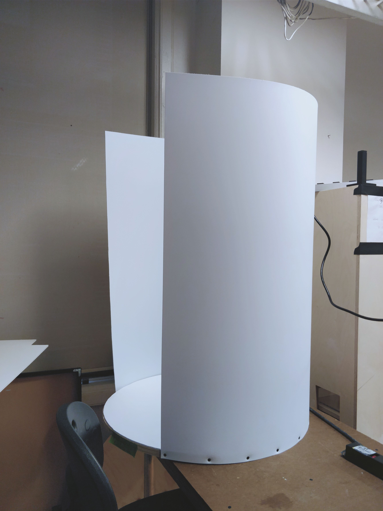
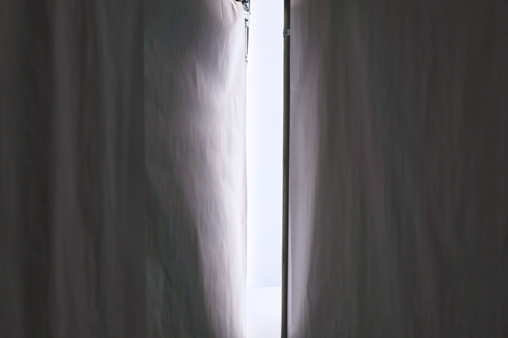
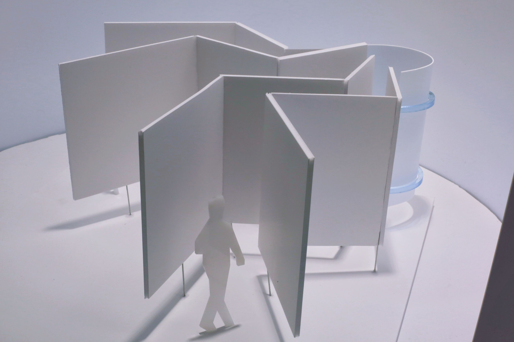
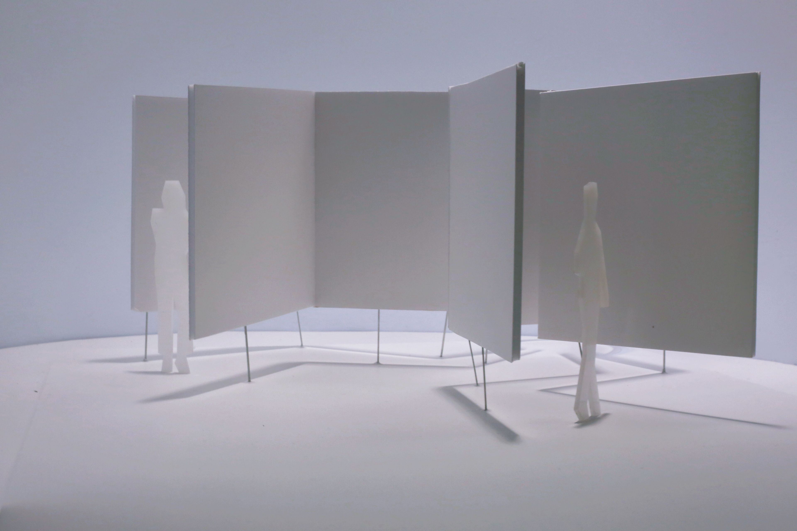

# "m e e t _ " - Roland + Nicolás

> “m e e t _ ” is a physical installation piece that provokes the crossing of two gazes of strangers in mid-air in an immersive and infinite space.

## Concept
What happens if the physical encounter of two bodies is replaced by a virtual encounter in mid-air between two gazes? What if you don't see somebody’s eyes, but you you know you are looking at the same point in the distance?

We want to entice the audience, bringing their imagination to reality by hiding the external presence and letting only their gazes meet. This virtual encounter takes place over an infinite space, created by a cylindrical illuminated surface, which makes the intersection dance while engulfing the attention of the participants. In the end, this journey becomes a communal experience, a shared moment between two presences.

## Ideation & implementation
We began the exploration of the presence with the element of a corner, representing the moment of uncertainty about another person coming towards the same junction. However, this time the presence is certain but the physical crossing is replaced by the intersection of the gazes in a projected infinite space.

The cylinder was created with a plastic styrene sheet, mounted on a wooden disc covered with a white matboard layer. The inside had to be kept extremely clean, as any particle would introduce noise which would enable our brains to find a focal point and lose the infinity illusion.

As this was a small scale installation, the walls were created by placing white paper over white boards. With them, we formed one segment of each hallway. In order to have a better experience, the hallways were kept in the dark, while the cylinder acted as a light source, beacon and alluring intersection for the participants.

Finally, in order to get a better grasp of the full idea, we built a scale model of the full installation. It used needles to make the walls and cylinder "float" above ground and it preserved the color and feel of the experience.

